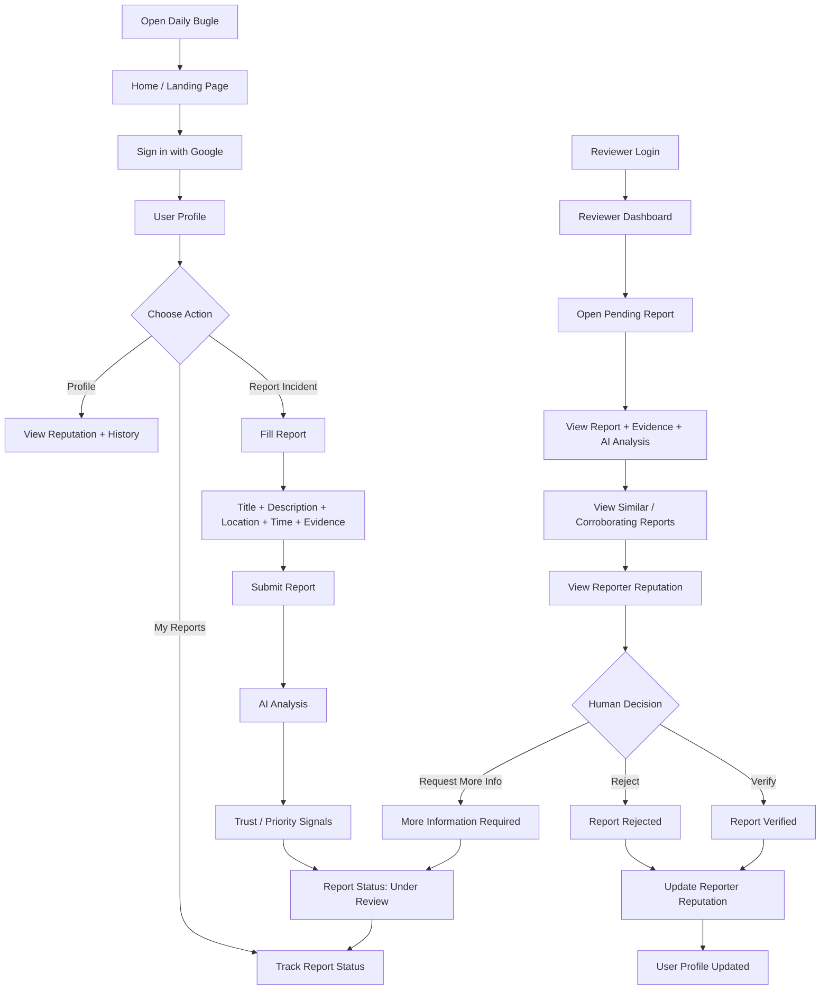
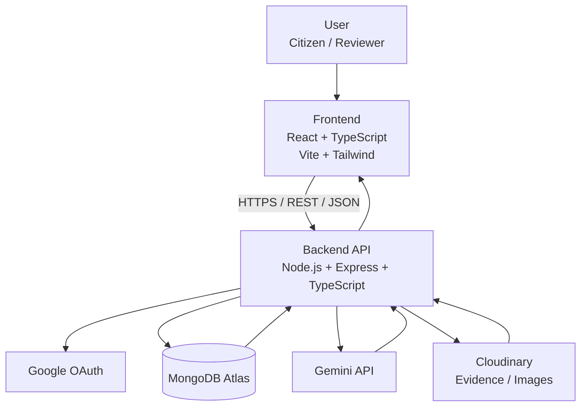
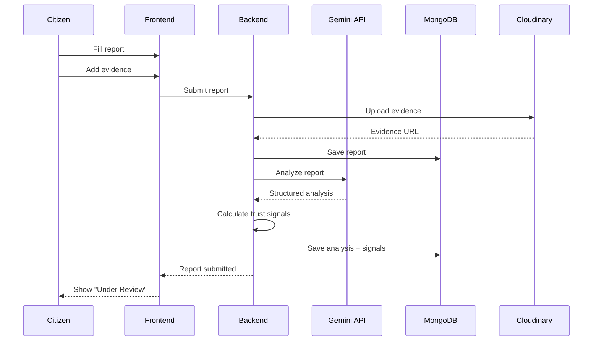
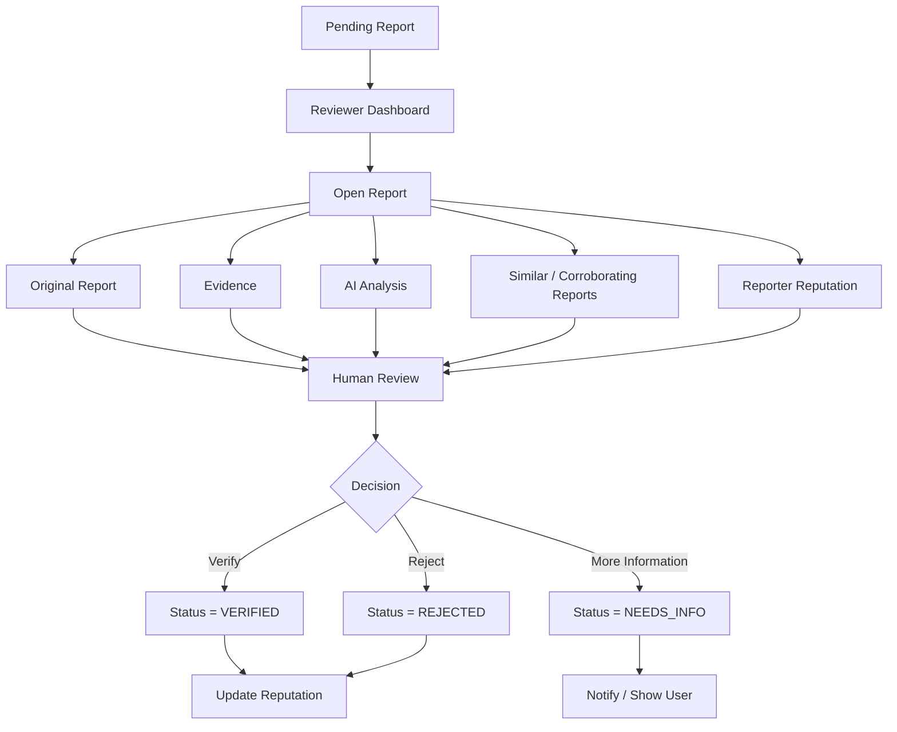
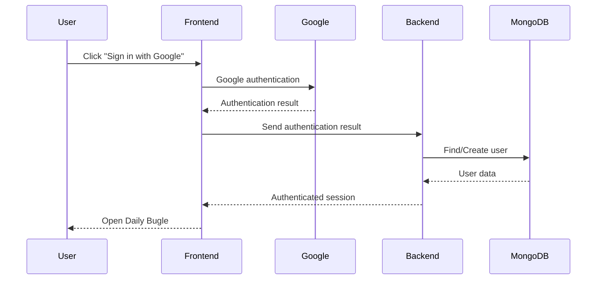
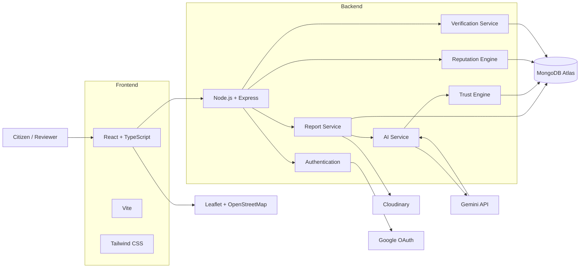

# Daily Bugle — Architecture & Technical Overview

> **Hackathon:** Bit N Build — Odisha State Qualifier  
> **Project:** Daily Bugle News Engine  
> **Purpose:** A citizen-reporting platform that separates useful signals from noise through AI-assisted analysis, trust signals, and human verification.

---

## 1. Problem Overview

Citizens can report suspicious activities or incidents, but raw reports may contain:

- Incomplete information
- Rumors or noise
- Duplicate reports
- Contradictory information
- Potentially misleading submissions

Daily Bugle provides a **trust layer** between citizen reports and human reviewers.

### Core principle

> **AI does not decide whether a report is true.**

AI analyzes and structures the report. The system combines AI analysis, report evidence, corroboration, consistency, and reporter reputation into useful **priority/credibility signals**. A human reviewer makes the final verification decision.

---

# 2. Product Flow



---

# 3. High-Level System Architecture



---

# 4. Detailed Architecture

## Frontend

The frontend is responsible for:

- User interface
- Citizen reporting
- User profile
- Report history
- Report tracking
- Reviewer dashboard
- AI analysis visualization
- Trust/priority signals
- Evidence viewing
- Incident map

### Main screens

```text
frontend/
├── Home
├── Login
├── Report Incident
├── My Reports
├── Report Details
├── Profile
├── Reviewer Dashboard
├── Review Report
└── Incident Map
```

---

# 5. Backend

The backend is the central coordinator of the application.

It handles:

- Authentication
- REST APIs
- Report management
- User management
- Reputation
- Trust/priority calculation
- AI integration
- Verification
- Evidence handling

### Backend structure

```text
backend/
├── routes/
│   ├── auth
│   ├── reports
│   ├── users
│   ├── review
│   └── incidents
│
├── controllers/
│
├── services/
│   ├── ai
│   ├── trust
│   ├── reputation
│   └── incident
│
├── models/
│   ├── user
│   ├── report
│   ├── incident
│   └── verification
│
├── middleware/
│   └── auth
│
└── server
```

---

# 6. API Communication

Frontend communicates with the backend using REST APIs.

### Example endpoints

```text
POST   /api/auth/google
GET    /api/users/me

POST   /api/reports
GET    /api/reports
GET    /api/reports/:id
GET    /api/reports/my

PATCH  /api/reports/:id/status

POST   /api/reports/:id/evidence

GET    /api/incidents
GET    /api/incidents/:id

GET    /api/reviewer/reports
POST   /api/reviewer/reports/:id/verify
POST   /api/reviewer/reports/:id/reject
POST   /api/reviewer/reports/:id/request-info

GET    /api/dashboard/stats
```

The exact endpoints may change during implementation.

---

# 7. Report Submission Flow



---

# 8. AI Architecture

The AI is an **analysis layer**, not the final verification authority.

### AI responsibilities

1. Report classification
2. Information extraction
3. Missing-information detection
4. Suspicious-signal identification
5. Contradiction detection
6. Report summarization
7. Similar-report analysis where applicable

### Example

Input:

```text
"I saw two people trying to break the ATM near the main gate around 11 PM."
```

AI can produce structured information such as:

```json
{
  "category": "Suspicious Activity",
  "summary": "Two individuals allegedly attempted to access an ATM unlawfully.",
  "specificity": 85,
  "missing_information": [],
  "urgency": "HIGH",
  "suspicious_signals": [],
  "recommended_action": "Human verification required"
}
```

The backend stores this analysis.

---

# 9. Trust / Priority Engine

The Trust Engine is application logic, not an AI model.

Example signals:

```text
Location provided          +10
Time provided               +10
Detailed description        +10
Evidence attached           +15
Corroborating reports       +25
Consistent reports          +10
Contradictory information   -20
Missing information         -10
```

The exact scoring values are configurable and may be changed after testing.

### Important distinction

```text
AI
 ↓
"What information/signals are present?"

Trust Engine
 ↓
"How much attention should this report receive?"

Human Reviewer
 ↓
"Should this report be verified?"
```

---

# 10. Reputation System

Users build reputation from their historical reporting outcomes.

Example:

```text
New user                 → 0 points
Verified report          → +10
Rejected report          → -5
Repeated spam/false use  → additional penalty
```

Possible profile display:

```text
Reputation: 60
Reports Submitted: 8
Verified Reports: 6
Rejected Reports: 2

Badge: Trusted Reporter
```

### Important

Reporter reputation is **only one signal**.

A high-reputation user does not automatically make a new report true.

---

# 11. Human Verification Flow



---

# 12. Database Structure

MongoDB will store the main application data.

### Users

```text
User
├── name
├── email
├── googleId
├── reputation
├── reportsSubmitted
├── reportsVerified
├── reportsRejected
└── badges
```

### Reports

```text
Report
├── userId
├── title
├── description
├── category
├── location
├── timestamp
├── evidence
├── status
├── aiAnalysis
├── trustSignals
└── incidentId
```

### Incidents

Multiple reports may refer to the same real-world incident.

```text
Incident
├── title
├── category
├── location
├── reports[]
├── corroborationCount
├── status
└── createdAt
```

### Verification

```text
Verification
├── reportId
├── reviewerId
├── decision
├── notes
└── timestamp
```

---

# 13. Evidence Flow

```text
Citizen
   ↓
Frontend
   ↓
Backend
   ↓
Cloudinary
   ↓
Evidence URL
   ↓
MongoDB
   ↓
Report
```

The database stores the evidence reference/URL rather than the actual large media file.

---

# 14. Authentication Flow



DigiLocker authentication is **not included** in the MVP architecture.

---

# 15. Incident Map

The application can provide a map view of reported incidents.

```text
Incident Map
│
├── High Priority
├── Under Review
├── Verified
└── Rejected
```

Users can select a marker to view the incident summary and status.

---

# 16. Final Tech Stack

| Layer | Technology | Purpose |
|---|---|---|
| Frontend | React | Web application |
| Frontend Language | TypeScript | Type-safe frontend |
| Build Tool | Vite | Development/build |
| Styling | Tailwind CSS | UI styling |
| Backend | Node.js | Server runtime |
| Backend Framework | Express.js | REST API |
| Backend Language | TypeScript | Backend development |
| Database | MongoDB Atlas | Application data |
| ODM | Mongoose | MongoDB interaction |
| Authentication | Google OAuth 2.0 | User authentication |
| AI | Gemini API | Report analysis |
| File Storage | Cloudinary | Evidence/images |
| Maps | Leaflet + OpenStreetMap | Incident visualization |
| Communication | REST + JSON | Frontend ↔ Backend |
| Version Control | Git + GitHub | Collaboration/versioning |
| Frontend Deployment | Vercel | Web deployment |
| Backend Deployment | Render / Railway | API deployment |
| Database Hosting | MongoDB Atlas | Cloud database |

---

# 17. Complete Architecture



---

# 18. Development Priority

Build in this order:

```text
1. Frontend base
       ↓
2. Backend + REST API
       ↓
3. MongoDB connection
       ↓
4. User authentication
       ↓
5. Report submission
       ↓
6. Report storage
       ↓
7. Reviewer dashboard
       ↓
8. Verification workflow
       ↓
9. Reputation system
       ↓
10. AI integration
       ↓
11. Evidence upload
       ↓
12. Incident map
       ↓
13. UI polish + testing
       ↓
14. Deployment
       ↓
15. Demo video + final submission
```

---

# 19. Core Product Loop

```text
        REPORT
           ↓
     AI ANALYSIS
           ↓
    TRUST SIGNALS
           ↓
     HUMAN REVIEW
           ↓
    ┌──────┼──────┐
    ↓      ↓      ↓
 VERIFY  REJECT  NEEDS INFO
    ↓
REPUTATION UPDATE
    ↓
 FUTURE REPORT SIGNAL
```

## Guiding Principle

> **Daily Bugle does not claim to automatically determine truth. It helps humans separate signal from noise by combining structured reporting, AI-assisted analysis, corroboration, evidence, and reporter history.**
